# Neural Child System Architecture

```mermaid
graph TB
    subgraph Core_System[Neural Child Core System]
        DC[DigitalChild] --> |contains| Brain[DynamicNeuralChild]
        DC --> |learns through| ML[MetaLearningSystem]
        DC --> |stores in| Mem[DifferentiableMemory]
        DC --> |guided by| Mother[MotherLLM]
        DC --> |develops via| Curr[DevelopmentalSystem]
    end

    subgraph Learning_Components[Learning & Development]
        ML --> |optimizes| NAS[NeuralArchitectureSearch]
        ML --> |evolves via| GO[GeneticOptimizer]
        ML --> |manages| NB[NegativeBehaviorModule]
        
        subgraph Negative_Behaviors[Emotional & Behavioral System]
            NB --> |influences| ES[Emotional States]
            NB --> |manifests as| BM[Behavioral Manifestations]
            NB --> |shaped by| PT[Personality Traits]
            NB --> |affected by| EF[Environmental Factors]
        end
    end

    subgraph Memory_System[Memory & Experience]
        Mem --> |stores| STM[Short-term Memory]
        Mem --> |consolidates| LTM[Long-term Clusters]
        Mem --> |manages| WM[Working Memory]
        Mem --> |optimizes via| RO[ReplayOptimizer]
    end

    subgraph Development_Stages[Developmental Progression]
        Curr --> |starts at| N[Newborn]
        N --> |develops to| I[Infant]
        I --> |grows to| T[Toddler]
        T --> |advances to| P[Preschool]
        P --> |progresses to| C[Child]
        C --> |matures to| A[Adolescent]
    end

    subgraph Mother_System[Mother LLM System]
        Mother --> |provides| SP[Stage-appropriate Prompts]
        Mother --> |generates| SR[Stimuli & Responses]
        Mother --> |tracks| EH[Emotional History]
        Mother --> |maintains| CH[Conversation History]
    end

    subgraph Meta_Components[Meta-Learning Components]
        NAS --> |generates| Arch[Neural Architectures]
        GO --> |maintains| Pop[Population Pool]
        GO --> |performs| Mut[Mutations]
        GO --> |executes| Cross[Crossover]
    end

    subgraph Safety_Features[Safety & Monitoring]
        Brain --> |monitors| Val[Input Validation]
        Brain --> |ensures| Shape[Shape Compatibility]
        Brain --> |implements| Error[Error Handling]
        Brain --> |manages| Grad[Gradient Checks]
    end

    %% Connections between major components
    DC --> |influenced by| Negative_Behaviors
    Mother_System --> |shapes| Development_Stages
    Learning_Components --> |optimizes| Memory_System
    Safety_Features --> |protects| Core_System

    classDef core fill:#f9f,stroke:#333,stroke-width:4px
    classDef system fill:#bbf,stroke:#333,stroke-width:2px
    classDef component fill:#dfd,stroke:#333
    classDef safety fill:#fdd,stroke:#333

    class DC,Brain,ML,Mem,Mother core
    class Learning_Components,Memory_System,Development_Stages,Mother_System system
    class NAS,GO,NB,STM,LTM,WM,RO component
    class Safety_Features,Val,Shape,Error,Grad safety
```

## Key Components Description

1. **Core System**
   - `DigitalChild`: Main class orchestrating all components
   - `DynamicNeuralChild`: Neural network brain implementation
   - `MetaLearningSystem`: Learning optimization system
   - `DifferentiableMemory`: Experience storage and retrieval
   - `MotherLLM`: Guidance and feedback system

2. **Learning & Development**
   - Neural Architecture Search for optimizing brain structure
   - Genetic Optimization for evolving better models
   - Negative Behavior Module for realistic development
   - Emotional and behavioral systems

3. **Memory System**
   - Short-term memory for recent experiences
   - Long-term memory clusters for consolidated learning
   - Working memory for active processing
   - Replay optimization for memory consolidation

4. **Development Stages**
   - Progressive stages from newborn to adolescent
   - Stage-appropriate learning and responses
   - Developmental curriculum management

5. **Mother LLM System**
   - Stage-appropriate prompts and responses
   - Emotional and conversational history
   - Adaptive feedback mechanisms

6. **Safety Features**
   - Input validation and shape compatibility
   - Error handling and recovery
   - Gradient checking and monitoring
   - Safe behavioral bounds

## Interaction Flow

1. Input → Validation → Processing → Response
2. Experience → Memory → Consolidation → Learning
3. Feedback → Emotional Update → Behavioral Modification
4. Performance → Meta-Learning → Architecture Evolution

The system maintains a balance between:
- Learning and stability
- Positive and negative behaviors
- Short-term and long-term memory
- Individual development and guided learning 