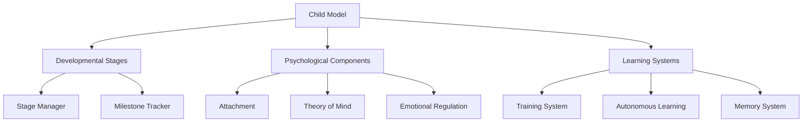
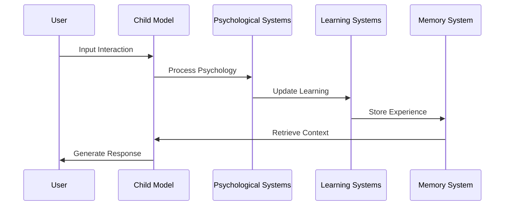

# System Architecture

The Neural Child Development System is built with a modular, extensible architecture that simulates child development through interconnected neural networks and psychological components.

## High-Level Overview

## Core Components

### 1. Child Model (`child_model.py`)
The central component that coordinates all subsystems:
- Neural network architecture
- State management
- Component coordination
- Input/output processing

### 2. Developmental Stages (`developmental_stages.py`)
Manages progression through developmental phases:
- Age-appropriate behaviors
- Milestone tracking
- Stage transitions
- Developmental metrics

### 3. Psychological Components
Interconnected systems modeling psychological development:

#### Attachment System (`attachment.py`)
- Relationship modeling
- Bonding patterns
- Social interaction processing
- Attachment style development

#### Theory of Mind (`theory_of_mind.py`)
- Social understanding
- Perspective taking
- Belief modeling
- Intention recognition

#### Emotional Regulation (`emotional_regulation.py`)
- Emotion processing
- Response modulation
- Coping strategies
- Affect management

### 4. Learning Systems

#### Training System (`training_system.py`)
- Core learning algorithms
- Parameter updates
- Loss computation
- Optimization

#### Autonomous Learning (`autonomous_learner.py`)
- Self-directed exploration
- Curiosity-driven learning
- Skill acquisition
- Knowledge building

#### Memory System (`memory_module.py`)
- Experience storage
- Memory consolidation
- Retrieval mechanisms
- Pattern recognition

## Data Flow

## State Management

### State Components
- Development stage
- Emotional state
- Memory state
- Relationship states
- Learning progress

### Persistence
- Checkpoint system
- State serialization
- Recovery mechanisms
- Version compatibility

## Safety and Security

### Sandbox Environment
- Isolated execution
- Resource limits
- Input validation
- Output filtering

### Error Handling
- Graceful degradation
- State recovery
- Error logging
- Debug information

## Performance Considerations

### Optimization
- Batch processing
- GPU acceleration
- Memory management
- Caching strategies

### Scalability
- Distributed training
- Load balancing
- Resource allocation
- Performance monitoring

## Integration Points

### External Systems
- LLM integration
- Data storage
- Monitoring tools
- Analysis systems

### APIs
- REST endpoints
- WebSocket connections
- Event streams
- Command interfaces

## Development Guidelines

### Code Organization
- Modular design
- Clear dependencies
- Interface contracts
- Documentation standards

### Testing Strategy
- Unit tests
- Integration tests
- Behavioral tests
- Performance benchmarks

## Future Extensions

### Planned Features
- Advanced social modeling
- Enhanced learning algorithms
- Improved emotional processing
- Extended developmental stages

### Integration Options
- Custom psychological components
- Alternative learning systems
- External data sources
- Visualization tools

## Further Reading

- [API Documentation](../api/index.md)
- [Development Guide](../guides/development.md)
- [Component Details](../components/index.md)
- [Implementation Examples](../examples/index.md) 