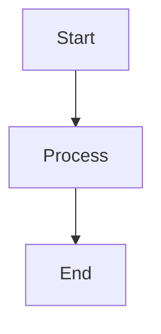

# Documentation Guide

This guide explains how to build, maintain, and contribute to the Neural Child Development System documentation.

## Setup

### Prerequisites

- Python 3.8 or higher
- Git
- A text editor (VS Code recommended)

### Initial Setup

1. Clone the repository:
```bash
git clone https://github.com/yourusername/neural-child.git
cd neural-child
```

2. Navigate to the docs directory:
```bash
cd docs
```

3. Create a virtual environment:
```bash
# On Unix/macOS
python -m venv docs_venv
source docs_venv/bin/activate

# On Windows (PowerShell)
python -m venv docs_venv
.\docs_venv\Scripts\Activate.ps1

# On Windows (Command Prompt)
python -m venv docs_venv
.\docs_venv\Scripts\activate.bat
```

4. Install documentation dependencies:
```bash
pip install -r requirements.txt
```

## Building Documentation

### Using the Build Scripts

#### On Windows

Use the batch script:
```batch
# Build only
build_docs.bat

# Build and serve locally
build_docs.bat serve

# Build versioned documentation
build_docs.bat version 1.1.0
```

#### On Unix/macOS

Use the shell script:
```bash
# Make the script executable
chmod +x build_docs.sh

# Build only
./build_docs.sh

# Build and serve locally
./build_docs.sh serve

# Build versioned documentation
./build_docs.sh version 1.1.0
```

### Manual Building

If you prefer to build manually:

1. Build the documentation:
```bash
mkdocs build
```

2. Serve locally (optional):
```bash
mkdocs serve
```

3. Create versioned documentation (optional):
```bash
mike deploy --push --update-aliases 1.1.0 latest
```

## Documentation Structure

```
docs/
├── index.md              # Main landing page
├── mkdocs.yml           # MkDocs configuration
├── requirements.txt     # Documentation dependencies
├── build_docs.sh        # Unix build script
├── build_docs.bat       # Windows build script
├── api/                 # API documentation
├── guides/             # User guides
├── components/         # Component documentation
├── architecture/       # Architecture documentation
├── examples/           # Code examples
└── support/           # Support documentation
```

## Writing Documentation

### Markdown Guidelines

1. Use headers appropriately:
```markdown
# Main Title (H1)
## Section (H2)
### Subsection (H3)
#### Minor Section (H4)
```

2. Code blocks with syntax highlighting:
````markdown
```python
def example_code():
    return "Hello, World!"
```
````

3. Admonitions for important notes:
```markdown
!!! note
    Important information here.

!!! warning
    Critical warning here.
```

4. Tables for structured data:
```markdown
| Header 1 | Header 2 |
|----------|----------|
| Cell 1   | Cell 2   |
```

### Adding Diagrams

Use Mermaid for diagrams:

````markdown

````

### Adding API Documentation

1. Document classes with docstrings:
```python
class ExampleClass:
    """
    Class description.

    Attributes:
        attr1 (type): Description
        attr2 (type): Description
    """
```

2. Document methods:
```python
def example_method(param1: str, param2: int) -> bool:
    """
    Method description.

    Args:
        param1 (str): Parameter description
        param2 (int): Parameter description

    Returns:
        bool: Return value description

    Raises:
        ValueError: Error description
    """
```

## Versioning

### Creating New Versions

1. Update version in relevant files:
   - `mkdocs.yml`
   - `pyproject.toml`
   - `CHANGELOG.md`

2. Build versioned documentation:
```bash
./build_docs.sh version X.Y.Z
```

### Managing Multiple Versions

```bash
# List versions
mike list

# Set default version
mike set-default X.Y.Z

# Delete version
mike delete X.Y.Z
```

## Deployment

### Local Preview

```bash
mkdocs serve
```

Access at `http://localhost:8000`

### GitHub Pages

1. Configure GitHub Pages:
```bash
mike deploy --push --update-aliases X.Y.Z latest
```

2. Enable GitHub Pages in repository settings:
   - Source: `gh-pages` branch
   - Folder: `/ (root)`

### Custom Domain

1. Add CNAME file:
```bash
echo "docs.yourproject.com" > docs/CNAME
```

2. Update DNS settings with your provider

## Best Practices

1. **File Organization**
   - Keep related content together
   - Use consistent naming
   - Maintain clear hierarchy

2. **Content Guidelines**
   - Write clear, concise content
   - Include practical examples
   - Keep code snippets focused
   - Add visual aids when helpful

3. **Maintenance**
   - Regular updates
   - Version consistency
   - Link checking
   - Spell checking

4. **Performance**
   - Optimize images
   - Minimize custom JavaScript
   - Use appropriate image formats

## Common Issues

### Build Failures

1. **Missing Dependencies**
```bash
pip install -r requirements.txt
```

2. **Python Version Mismatch**
```bash
python --version  # Ensure 3.8+
```

3. **Permission Issues**
```bash
chmod +x build_docs.sh
```

### Rendering Issues

1. **Mermaid Diagrams Not Showing**
   - Check plugin installation
   - Verify syntax
   - Clear browser cache

2. **Code Highlighting Issues**
   - Specify language
   - Check syntax
   - Update Pygments

## Contributing

1. Fork the repository
2. Create documentation branch
3. Make changes
4. Build and test locally
5. Submit pull request

See [Contributing Guide](contributing.md) for more details.

## Resources

- [MkDocs Documentation](https://www.mkdocs.org/)
- [Material for MkDocs](https://squidfunk.github.io/mkdocs-material/)
- [Markdown Guide](https://www.markdownguide.org/)
- [Mermaid Documentation](https://mermaid-js.github.io/mermaid/) 