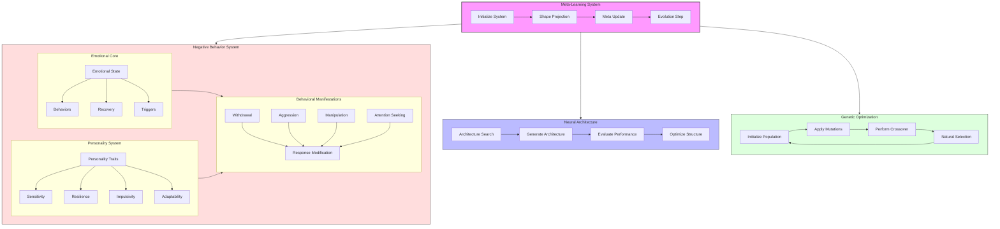

# Module-Level Architecture Diagrams

## main.py - Core Execution Flow

```mermaid
graph TB
    subgraph Main_Execution[Main Execution Flow]
        Init[Initialize System] --> Interface[Create Interface]
        Interface --> Server[Launch Server]
        Server --> Loop[Main Loop]
    end

    subgraph Main_Loop[Main Processing Loop]
        Stimulus[Generate Stimulus] --> Perception[Process Perception]
        Perception --> Response[Generate Response]
        Response --> Learning[Learning Step]
        Learning --> Update[Update State]
        Update --> Stimulus
    end

    subgraph Error_Handling[Error Management]
        Retry[Retry Mechanism] --> Fallback[Fallback Responses]
        Fallback --> Recovery[State Recovery]
        Recovery --> Logging[Error Logging]
    end

    subgraph Server_Config[Server Configuration]
        Config[Load Config] --> Env[Set Environment]
        Env --> Session[Create Session]
        Session --> Retries[Configure Retries]
    end

    subgraph Development_Control[Developmental Control]
        Stage[Current Stage] --> Prompts[Stage Prompts]
        Prompts --> Feedback[Generate Feedback]
        Feedback --> Progress[Track Progress]
    end

    %% Connections
    Main_Execution --> Server_Config
    Main_Loop --> Error_Handling
    Main_Loop --> Development_Control

    classDef process fill:#f9f,stroke:#333,stroke-width:2px
    classDef config fill:#bbf,stroke:#333
    classDef error fill:#fdd,stroke:#333
    classDef dev fill:#dfd,stroke:#333

    class Main_Execution,Main_Loop process
    class Server_Config config
    class Error_Handling error
    class Development_Control dev
```


## meta_learning.py - Learning System Architecture


## Component Interactions

### main.py Key Features:
1. **Main Execution Flow**
   - System initialization
   - Interface creation
   - Server management
   - Main processing loop

2. **Error Handling**
   - Retry mechanisms
   - Fallback responses
   - State recovery
   - Error logging

3. **Server Configuration**
   - Environment setup
   - Session management
   - Retry configuration

4. **Development Control**
   - Stage management
   - Prompt generation
   - Progress tracking

### meta_learning.py Key Features:
1. **Meta-Learning System**
   - Shape projection
   - Meta updates
   - Evolution management

2. **Negative Behavior System**
   - Emotional core
   - Personality traits
   - Behavioral manifestations
   - Response modifications

3. **Architecture Management**
   - Structure search
   - Performance evaluation
   - Optimization

4. **Genetic Evolution**
   - Population management
   - Mutation/Crossover
   - Natural selection

## Interaction Flow

1. **Main System Flow**:
   ```
   Initialize → Configure → Process → Learn → Update
   ```

2. **Meta-Learning Flow**:
   ```
   Project → Update → Evolve → Optimize
   ```

3. **Behavior Flow**:
   ```
   Emotion → Personality → Behavior → Manifestation
   ```

4. **Architecture Flow**:
   ```
   Search → Generate → Evaluate → Optimize
   ``` 